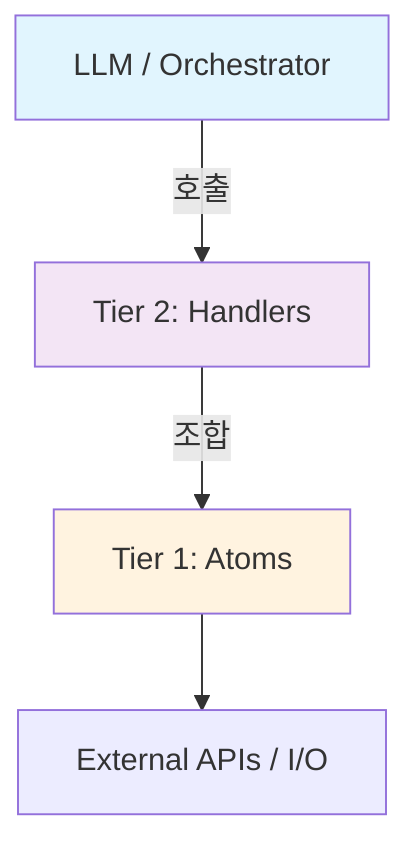

# Rule Scripts 2-Tier Architecture

JobRunner 스크립트는 **2단계 계층 구조**로 설계됩니다.

## 개요



## Tier 1: Atomic Functions

**특징:**
- 단일 책임 (하나의 I/O 작업만 수행)
- 재사용 가능, 순수 함수에 가까움
- AI에 직접 노출되지 않음

**예시:**
```python
# scripts/utils/telegram.py
async def send_telegram_message(chat_id: str, message: str) -> bool:
    ...

# scripts/utils/storage.py
async def store_artifact(key: str, data: dict) -> str:
    ...

# scripts/utils/http.py
async def fetch_json(url: str) -> dict:
    ...
```

## Tier 2: Handler Functions (Rule Scripts)

**특징:**
- 비즈니스 로직 조합
- AI가 호출/생성 가능
- `@rule` 데코레이터로 등록

**예시:**
```python
# scripts/stock/check_price.py
from scripts.registry import rule
from scripts.utils.http import fetch_json
from scripts.utils.telegram import send_telegram_message

@rule(tags=["finance", "monitoring"])
async def check_stock_price(payload: dict) -> dict:
    """주가 모니터링 및 알림."""
    ticker = payload.get("ticker", "AAPL")
    threshold = payload.get("threshold", 0.05)
    
    # Tier 1 호출
    data = await fetch_json(f"https://api.example.com/stock/{ticker}")
    
    if data["change_pct"] > threshold:
        await send_telegram_message(
            chat_id=payload["chat_id"],
            message=f"🚀 {ticker} +{data['change_pct']:.1%}"
        )
    
    return {"success": True, "price": data["price"]}
```

## Why 2-Tier?

| 관점 | Tier 1 (Atoms) | Tier 2 (Handlers) |
|------|---------------|-------------------|
| LLM 노출 | ❌ No | ✅ Yes |
| 컨텍스트 비용 | Low (내부 구현) | High (API 표면) |
| 재사용 | 높음 | 보통 |
| 테스트 | 단위 테스트 | 통합 테스트 |

## Callback System 적용

콜백도 동일한 2-tier 구조:

```python
# Tier 1: Atoms
async def send_telegram_message(chat_id, message) -> bool
async def write_log(level, message) -> bool

# Tier 2: Handlers
class TelegramCallbackHandler(CallbackHandler):
    async def execute(self, context) -> bool:
        # Tier 1 조합
        return await send_telegram_message(...)

class ChainCallbackHandler(CallbackHandler):
    # 다른 handlers 조합
    ...
```

## 디렉토리 구조

```
scripts/
├── registry.py        # @rule 데코레이터
├── hello_world/       # Tier 2 예제
│   └── main.py
├── stock/             # Tier 2 도메인
│   └── check_price.py
└── utils/             # Tier 1 atoms
    ├── telegram.py
    ├── storage.py
    └── http.py
```
