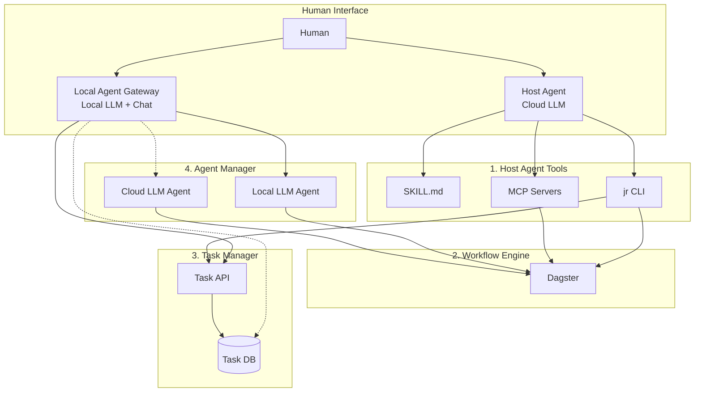

# JobRunner 모듈 구성

> 최종 시점의 시스템 모듈 구조를 정의한다.

---

## 모듈 개요

```
┌─────────────────────────────────────────────────────────────────────────┐
│                         Human (사용자)                                   │
└─────────────────────────────────────────────────────────────────────────┘
          ↓                                           ↓
┌─────────────────────────────┐        ┌─────────────────────────────────┐
│ Host Agent                  │        │ 5. Local Agent Gateway          │
│ (Gemini CLI, Claude Code)   │        │    (채팅 인터페이스)              │
│ - 고급 작업, 복잡한 판단       │        │    - 간단한 상호작용              │
└─────────────────────────────┘        └─────────────────────────────────┘
          ↓                                           ↓
┌─────────────────┐    ┌─────────────────┐    ┌─────────────────┐
│ 1. Host Agent   │    │ 2. Workflow     │    │ 3. Task         │
│    Tools        │    │    Engine       │    │    Manager      │
│                 │    │    (Dagster)    │    │                 │
└─────────────────┘    └─────────────────┘    └─────────────────┘
                                  ↓
                       ┌─────────────────┐
                       │ 4. Agent        │
                       │    Manager      │
                       └─────────────────┘
```

---

## Human Interface Layer

사용자와 시스템 간의 두 가지 진입점.

| 인터페이스 | 특징 | 적합한 작업 |
|-----------|------|------------|
| **Host Agent** | Cloud LLM 기반, Skill/MCP 풀 활용 | 복잡한 판단, 코드 생성, 시스템 관리 |
| **Local Agent Gateway** | Local LLM 기반, 채팅 인터페이스 | 간단한 상호작용, 빠른 응답, 상시 가동 |

---

## 1. Host Agent Tools

Host Agent(Gemini CLI, Claude Code 등)가 시스템을 제어하기 위해 사용하는 도구 모음.

### 1.1. Agent Skill (SKILL.md)

| 항목 | 설명 |
|------|------|
| **역할** | Host Agent의 행동 지침 제공 |
| **형식** | SKILL.md + 스크립트 |
| **예시** | `jr_usage.md` - jr CLI 사용법, `dagster_guide.md` - Dagster 작업 가이드 |

### 1.2. CLI Tool (`jr`)

| 항목 | 설명 |
|------|------|
| **역할** | Host Agent가 시스템을 조작하는 CLI 인터페이스 |
| **기술 스택** | Python Click/Typer |
| **주요 명령** | `jr plan`, `jr run`, `jr tasks`, `jr status` 등 |

### 1.3. MCP Server 연동

| 항목 | 설명 |
|------|------|
| **역할** | Host Agent가 외부 도구/서비스에 직접 접근 |
| **후보** | Dagster MCP, GitHub MCP, Filesystem MCP |
| **채용 조건** | MCP 서버 품질에 따라 채용 여부 판단. CLI 대비 이점이 명확할 때 사용. |

> [!NOTE]
> MCP 서버 품질이 충분하면 CLI 없이 MCP만으로 제어 가능.
> 품질이 부족하면 CLI를 주력으로 사용하고 MCP는 보조로 활용.

---

## 2. Workflow Engine (Dagster)

정형화된 작업의 스케줄링과 실행을 담당.

| 항목 | 설명 |
|------|------|
| **역할** | 주기적 작업 실행, Job-Agent 협업 조율 |
| **기술 스택** | Dagster, Docker Compose |
| **핵심 기능** | Asset 관리, 스케줄링, 센서, 실행 로깅 |

### 주요 책임

- **주기적 작업:** 매일/매주 반복 실행되는 Job 스케줄링
- **Job-Agent 협업:** Agent가 생성한 결과를 Job이 후처리하거나, Job 결과를 Agent가 분석
- **실행 모니터링:** 실행 상태, 로그, 에러를 Dagster UI에서 시각화

---

## 3. Task Manager

Host Agent를 위한 영구 메모리 역할. TODO 작업의 생성, 추적, 전파를 담당.

| 항목 | 설명 |
|------|------|
| **역할** | 할일 관리, Host Agent의 영구 메모리 |
| **저장소** | PostgreSQL (자체 DB) |
| **접근 방식** | jr CLI 또는 FastAPI |

### 핵심 기능

- **Task CRUD:** Task 생성, 조회, 수정, 완료 처리
- **Task 분해:** 큰 Task → SubTask로 분할
- **상태 관리:** `pending` → `in_progress` → `review` → `done`
- **전파:** 필요시 다른 모듈(Workflow Engine, Agent Manager)로 Task 정보 전달

### Task 활용 패턴

```
Host Agent: "할일 목록 검토해줘"
    ↓
jr tasks list (또는 MCP)
    ↓
Task Manager에서 pending tasks 조회
    ↓
Host Agent가 결과 요약하여 사용자에게 보고
```

---

## 4. Agent Manager

Worker LLM Agent들의 설정을 관리하고 Workflow Engine에 제공.

| 항목 | 설명 |
|------|------|
| **역할** | Agent 설정 관리, Registry 제공 |
| **기술 스택** | Hub (FastAPI + PostgreSQL), LangChain/LangGraph |

> [!IMPORTANT]
> **설정/실행 분리 원칙**
> - **Hub**: Agent 설정(Configuration)만 관리 - Model, Skill, MCP 조합
> - **Workflow Engine**: 실제 LLM 호출 및 실행 담당 - LangGraph 생태계 활용

### 4.1. Configured Agent

Hub에서 설정으로 정의되는 Agent. Model + Skill/MCP 조합.

| 항목 | 설명 |
|------|------|
| **정의 위치** | Hub (configured_agents 테이블) |
| **실행 위치** | Workflow Engine (Dagster Op) |
| **구성 요소** | AI Model + System Prompt + Skills + MCPs |
| **적합한 작업** | 단일 LLM 호출 기반 작업, 간단한 추론 |

**예시:**
```yaml
name: "code-reviewer"
model: "ollama/qwen2.5-coder:7b"
system_prompt: "You are a code review assistant..."
skills: ["code_review", "git_diff"]
config:
  temperature: 0.3
  max_tokens: 4096
```

### 4.2. Graph Agent (LangGraph)

Workflow Engine에서 직접 정의되는 복잡한 Agent. LangGraph Asset으로 구현.

| 항목 | 설명 |
|------|------|
| **정의 위치** | Workflow Engine (Dagster Asset/Op) |
| **실행 위치** | Workflow Engine |
| **구성 요소** | LangGraph Graph + State + Nodes |
| **적합한 작업** | 멀티스텝 추론, ReAct, Plan-and-Execute |

**예시:**
```
graph LR
    A[Start] --> B{분석}
    B --> C[계획 수립]
    C --> D[실행]
    D --> E{검증}
    E -->|실패| C
    E -->|성공| F[End]
```

> [!NOTE]
> Graph Agent는 Workflow Engine에서 LangGraph Asset으로 개발.
> Hub는 Graph Agent의 메타데이터(이름, 설명)만 참조용으로 관리.

### 4.3. Registry 관리 (Hub)

Hub에서 관리하는 Registry 목록:

| Registry | 설명 |
|----------|------|
| **AIModelRegistry** | 사용 가능한 AI 모델 목록 (Ollama, OpenAI 등) |
| **SkillRegistry** | Agent에 주입 가능한 Skill 카탈로그 |
| **MCPRegistry** | Agent에 연결 가능한 MCP Server 목록 |
| **ConfiguredAgents** | Model + Skill/MCP 조합으로 정의된 Agent |

### Agent 실행 흐름

```
1. Workflow Engine이 Hub API에서 Agent 설정 조회
2. Configured Agent: 설정 기반으로 LangChain Agent 인스턴스화
3. Graph Agent: Dagster Asset에서 직접 LangGraph 실행
4. 실행 결과를 Hub의 agent_executions 테이블에 기록
```

---

## 5. Local Agent Gateway

Host Agent 없이 사용자와 직접 상호작용하는 Local LLM 기반 인터페이스.

| 항목 | 설명 |
|------|------|
| **역할** | 간단한 판단/응답, 작업 라우팅, 채팅 인터페이스 |
| **기술 스택** | Local LLM (Ollama), Chat UI (Streamlit 등) |
| **특징** | 상시 가동 가능, 비용 무료, 빠른 응답 |

### 5.1. Chat Interface

| 항목 | 설명 |
|------|------|
| **역할** | 사용자와 채팅 기반 상호작용 |
| **구현** | 웹 기반 (Streamlit, Gradio) 또는 Telegram Bot 등 |
| **범위** | 간단한 질문, 상태 확인, 빠른 명령 실행 |

**채팅 예시:**
```
사용자: "오늘 할일 뭐야?"
Gateway: "현재 pending 상태인 Task가 3개 있습니다:
         1. A지역 플랜 작성
         2. 주간 리포트 검토
         3. 코드 리뷰 요청
         어떤 작업을 먼저 처리할까요?"
```

### 5.2. Router

| 항목 | 설명 |
|------|------|
| **역할** | 들어온 작업을 적절한 처리 경로로 라우팅 |
| **기반** | Local LLM |
| **판단 기준** | 긴급도, 복잡도, 자원 가용성, Host Agent 필요 여부 |

**라우팅 규칙:**

| 조건 | 라우팅 대상 | 설명 |
|------|------------|------|
| 간단 + 직접 처리 가능 | Gateway 자체 처리 | 상태 조회, 간단한 응답 |
| 간단 + 작업 실행 필요 | Agent Manager | Local LLM Agent에 위임 |
| 복잡 + 비긴급 | Task Manager | 기입 후 Host Agent 판단 유보 |
| 복잡 + 긴급 | Cloud LLM Agent | 제한적 사용 |

### 5.3. 자율 판단 범위

Gateway가 Host Agent 개입 없이 자율적으로 처리할 수 있는 범위:

| 가능 | 불가능 (Host Agent 필요) |
|------|------------------------|
| 상태 조회 (Task, Job 상태) | 새로운 Job 코드 생성 |
| 간단한 질문 응답 | 복잡한 의사결정 |
| 기존 Job 즉시 실행 | 시스템 설정 변경 |
| Task 상태 업데이트 | 외부 서비스 연동 설정 |

---

## 모듈 간 상호작용



---

## Phase별 구현 범위

| 모듈 | Phase 1 | Phase 2 | Phase 3 |
|------|---------|---------|---------|
| **Host Agent Tools** | SKILL.md, jr CLI 기본 | MCP 연동 검토 | MCP 확장 |
| **Workflow Engine** | Dagster 기본 구성 | 동적 Asset 로딩 | Job-Agent 협업 |
| **Task Manager** | - | - | Task CRUD, 상태 관리 |
| **Agent Manager** | - | - | Local/Cloud Agent |
| **Local Agent Gateway** | - | - | Chat UI, Router |
