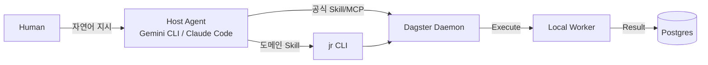
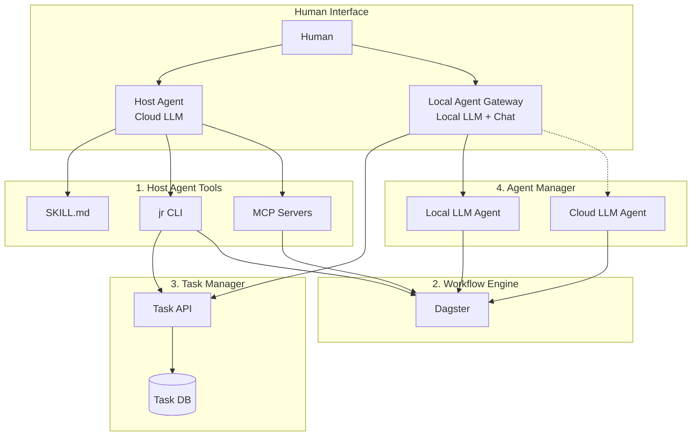

# 프로젝트 요구사항 명세서: JobRunner

## 1. 프로젝트 개요 (Vision)

* **프로젝트 명:** JobRunner
* **목표:** **"Host Agent와 Local Gateway가 협력하고, Workflow Engine이 실행한다."**
* 반복적인 개인 업무를 자동화하는 것을 넘어, **LLM의 생성 능력**과 **워크플로우 엔진의 안정성**을 결합한 **Human-in-the-Loop 자동화 플랫폼**을 로컬 환경에 구축한다.


* **핵심 컨셉:**
  * **(Foundation) Dagster 기반 워크플로우:** 모든 인프라는 로컬 Docker에서 구동된다. Dagster 공식 Skill/MCP를 활용하여 Host Agent가 워크플로우를 제어한다.
  * **(Phase 1) Agent & Task Management:** Local Agent Gateway를 통해 Human Interface를 이원화하고, Task Manager와 Agent Manager로 복잡한 작업의 분해/병렬처리/병합을 지원한다. **← 핵심 차별점**
  * **(Phase 2) Cloud Extension:** (Optional) 로컬 자원이 부족하거나 24시간 가동이 필수적인 경우에만 선별적으로 클라우드로 확장한다.
  * **(TBD) Dynamic Dagster:** 동적 코드 로딩은 Dagster 네이티브 기능 검토 후 필요시 구현.


* **프로젝트 시작 동기:**
> [!NOTE]
> 왜 오픈소스 에이전트 프레임워크 + LLM API 조합으로 시작하지 않고, 굳이 정형화된 플랫폼을 직접 구축하는가?


| 관점 | 직접 구축의 이점 |
| --- | --- |
| **비용 효율성** | Human-in-the-Loop 방식으로 LLM API 호출 최소화. Host Agent 사용량 + Local LLM 적극 활용. |
| **보안 및 통제력** | 내가 허락하지 않은 작업의 폭주 억제. 직접 만들었기에 한계를 알고, 블랙박스 실행보다 안심. |
| **안정적 재사용** | 한 번 코드화한 작업은 LLM 비결정성 없이 안정적으로 반복 실행 가능. |
| **커스터마이징** | 내가 만든 도구이므로 원하는 대로 확장 및 수정 가능. |
| **세밀한 트리거링** | API 자동 호출이 아닌, 원하는 시점에 Host Agent를 통해 명시적 트리거 가능. |
| **상시 가용성** | Local LLM 기반 Gateway로 Host Agent 없이도 간단한 상호작용 가능. |
| **인터페이스 다양성** | CLI(Host Agent)와 채팅 UI(Gateway) 중 상황에 맞는 인터페이스 선택. |


이 동기는 프로젝트 전반의 아키텍처 결정(Human-in-the-Loop, 단계적 승인 등)에 일관되게 반영된다.

---

## 2. 핵심 개념 정의 (Key Concepts)

> [!TIP]
> 상세한 모듈 구성은 [MODULES.md](./MODULES.md) 참조.

### 2.1. Human Interface Layer

사용자와 시스템 간의 두 가지 진입점을 제공한다.

| 인터페이스 | 기반 | 특징 | 적합한 작업 |
|-----------|------|------|------------|
| **Host Agent** | Cloud LLM | Skill/MCP 풀 활용, IDE/CLI 기반 | 복잡한 판단, 코드 생성, 시스템 관리 |
| **Local Agent Gateway** | Local LLM | 채팅 인터페이스, 상시 가동 | 간단한 상호작용, 빠른 응답, 상태 조회 |

```
┌─────────────────────────────────────────────────────────────────────────┐
│                         Human (사용자)                                   │
└─────────────────────────────────────────────────────────────────────────┘
          ↓                                           ↓
┌─────────────────────────────┐        ┌─────────────────────────────────┐
│ Host Agent                  │        │ Local Agent Gateway             │
│ (Gemini CLI, Claude Code)   │        │ (채팅 인터페이스)                │
│ - 고급 작업, 복잡한 판단    │        │ - 간단한 상호작용, 라우팅       │
└─────────────────────────────┘        └─────────────────────────────────┘
```

### 2.2. 시스템 모듈 구성

| 모듈 | 역할 |
| --- | --- |
| **1. Host Agent Tools** | Host Agent가 시스템을 제어하기 위한 도구 (SKILL.md, jr CLI, MCP) |
| **2. Workflow Engine** | 주기적/정형화된 작업 실행, Job-Agent 협업 (Dagster) |
| **3. Task Manager** | 할일 관리, Host Agent의 영구 메모리 |
| **4. Agent Manager** | Worker LLM Agent 생명주기 관리 (Local/Cloud LLM Agent) |
| **5. Local Agent Gateway** | 채팅 인터페이스, 작업 라우팅, 간단한 자율 판단 |

### 2.3. 유즈케이스별 처리 흐름

| 작업 유형 | 처리 주체 | 흐름 |
| --- | --- | --- |
| **주기적/정형 작업** | Host Agent → Dagster | Host Agent가 1회 등록, Dagster가 지속 실행. |
| **간단한 상호작용** | Local Agent Gateway | 채팅으로 상태 조회, 간단한 명령 실행. |
| **간단한 기존 작업** | Gateway → Agent Manager | Gateway가 라우팅, Local LLM Agent가 처리. |
| **복잡/비긴급 작업** | Task Manager | Task 등록 후 Host Agent 판단 유보. |
| **복잡/긴급 작업** | Cloud LLM Agent | 제한적 사용 (비용 발생). |

### 2.4. Job vs Task

| 용어 | 정의 | 예시 |
| --- | --- | --- |
| **Job** | Dagster에서 실행되는 코드화된 작업 단위 | `daily_stock_alert.py` |
| **Task** | 사용자 또는 에이전트가 수행해야 할 TODO 항목 | "A지역 여행 플랜 작성" |

* **Job**은 이미 코드로 정의되어 Dagster가 스케줄/트리거하는 안정적인 실행 단위.
* **Task**는 아직 해결되지 않은 작업 항목으로, 에이전트가 가져가 처리하거나 사람이 직접 처리할 수 있음.

### 2.5. Agent, Skill, MCP

| 용어 | 정의 |
| --- | --- |
| **Agent** | 특정 역할을 수행하는 LLM 기반 실행 주체 |
| **Skill** | SKILL.md 파일 + 스크립트로 정의된 능력. 프롬프트/지시사항 기반으로 Agent의 행동 패턴 확장 |
| **MCP** | Model Context Protocol. 외부 도구/서비스 연동 인터페이스 |
| **Role → Capability Mapping** | 역할에 따라 어떤 Skill과 MCP를 Agent에게 주입할지 정의 |

* Skill: 지시사항/스크립트 기반 (예: jr CLI 사용법, 코드 리뷰 가이드)
* MCP: 외부 도구 연동 (예: Dagster MCP, GitHub MCP, 파일시스템 MCP)
* 복잡한 flow는 LangGraph로 Agent App 생성 후 A2A 인터페이싱으로 리소스화 가능.

### 2.6. Dagster MCP 활용 가능성

> [!NOTE]
> Dagster 생태계에서 제공하는 MCP Server 활용을 검토 중.
> Host Agent가 Dagster Asset/Job을 직접 쿼리하고 트리거할 수 있는 가능성 있음.
> (상세 스펙 추후 확인)

---

## 3. Foundation - Dagster 기반 워크플로우

> [!NOTE]
> Dagster 공식 Skill/MCP가 풍부하게 지원되므로, 일반적인 Dagster 사용은 공식 도구로 충분히 커버된다.
> JobRunner는 도메인 특화 Skill과 추가 모듈 연동에 집중한다.

**구성 요소:**

* **로컬 런타임 환경:** 사용자 PC(Local)에서 `Docker Compose`로 Dagster, PostgreSQL, Redis를 구동.
* **Host Agent 연동:** Gemini CLI, Claude Code 등 Skill/MCP 지원 Agent Client가 시스템을 제어.
* **공식 Dagster Skill 활용:**
  * `dagster-expert`: 프로젝트 생성, asset 패턴, 자동화, CLI 커맨드
  * `dagster-integrations`: 82+ 통합 카탈로그
* **JobRunner 도메인 Skill (`jr`):** 본 프로젝트 구성에 특화된 CLI 및 가이드.
  * jr 사용법은 SKILL.md로 Host Agent에 주입됨.
* **Dagster 연동:** Dagster MCP 또는 jr CLI를 통해 제어.

---

## 4. Phase 1 범위 - Agent & Task Management

> [!IMPORTANT]
> JobRunner의 핵심 차별점. Human Interface 이원화와 멀티 Agent 협업 모델을 구축한다.

**In-Scope:**

### 4.1. Local Agent Gateway

| 항목 | 설명 |
|------|------|
| **역할** | 간단한 판단/응답, 작업 라우팅, 채팅 인터페이스 |
| **기술 스택** | Local LLM (Ollama), Chat UI (Streamlit 등) |
| **특징** | 상시 가동, 비용 무료, 빠른 응답 |

**자율 판단 범위:**
- 가능: 상태 조회, 간단한 질문 응답, 기존 Job 즉시 실행
- 불가 (Host Agent 필요): 새로운 Job 코드 생성, 복잡한 의사결정, 시스템 설정 변경

### 4.2. Task Manager

* **Task Storage:** 자체 DB (Postgres)
  * 쿼리 자유도 높음, Task-SubTask 관계/Agent 할당 이력 관리
  * 필요시 GitHub Issues 연동 가능
* **Task 패턴:**
  * Task 분해 (Decomposition): 큰 작업 → SubTask 분할
  * 병렬 할당 (Assignment): 유휴 Agent가 Task 처리
  * 결과 병합 (Aggregation): 최종 Planner가 통합

### 4.3. Agent Manager

| 컴포넌트 | 역할 | 사용 조건 |
| --- | --- | --- |
| **Local LLM Agent** | Local LLM 자원으로 경량 작업 처리 | 기본 |
| **Cloud LLM Agent** | Cloud LLM으로 복잡/긴급 작업 처리 | Host Agent 개입 불가 + Local LLM 한계 시 |

### 4.4. Agent Configuration

* **Agent Factory:** 역할 기반 Agent 인스턴스 생성.
* **Skill Registry:** SKILL.md 기반 능력 카탈로그.
* **MCP Registry:** MCP Server 목록 관리.
* **복잡한 Flow:** LangGraph → A2A 프로토콜로 리소스화.

---

## 5. Phase 2 범위 - Cloud Extension

* **Hybrid 전환:** `dagster-daemon` 컨테이너를 라즈베리파이 또는 VPS로 이동.
* **Cloud Native:** 팀 단위 협업/대규모 처리 시 K8s 확장 (현재 고려 대상 아님).

---

## 6. TBD - Dynamic Dagster

> [!NOTE]
> Dagster 네이티브 기능으로 동적 로딩이 가능할 수 있음.
> 실제 구현 필요성 및 방식은 추후 검토.

**검토 항목:**
* Dagster의 `Definitions` 동적 갱신 가능 여부
* `dagster-pipes` 활용 가능성
* Code Location 런타임 리로드 메커니즘

**잠재적 기능:**
* 동적 Asset 로딩: LLM이 생성한 Python 코드를 즉시 Asset으로 등록/실행
* 코드 버전 관리: 생성된 코드의 히스토리 관리 및 롤백 지원
* 향상된 템플릿 시스템: 다양한 유스케이스별 Dagster 코드 템플릿 확장

---

## 7. 핵심 전략: Human-in-the-Loop

> [!IMPORTANT]
> 본 프로젝트의 핵심 차별점은 **"자동화된 API 호출"**이 아니라 **"사용자 주도 생성 및 통제"**에 있다.

### 7.1. 왜 자동화 대신 Human-in-the-Loop인가?

| 비교 | **API 기반 자동화** | **Human-in-the-Loop (JobRunner)** |
| --- | --- | --- |
| **실행 방식** | LLM 자동 실행 | Host Agent/Gateway를 통한 명시적 트리거 |
| **비용** | API 호출마다 과금 | Host Agent + Local LLM 활용 |
| **통제력** | 블랙박스, 폭주 위험 | 코드 생성 → 사용자 리뷰 → 실행 |
| **모델 선택** | 고정 모델 | 작업별 모델 선택 가능 |

### 7.2. 구현 프로세스 (Job Factory Flow)

**Host Agent 경로 (복잡한 작업):**
```
1. 사용자 → Host Agent: "매일 아침 주가 알림 만들어줘"
2. Host Agent: jr SKILL.md 참조 → jr plan 실행
3. Host Agent: 코드 생성
4. 사용자: 리뷰 및 승인
5. Dagster: 스케줄 실행
```

**Local Agent Gateway 경로 (간단한 작업):**
```
1. 사용자 → Gateway (채팅): "오늘 할일 뭐야?"
2. Gateway: Task Manager 조회
3. Gateway → 사용자: 할일 목록 응답
```

---

## 8. 기능 요구사항 (Functional Requirements)

### Foundation 요구사항

| ID | 구분 | 기능명 | 설명 | 우선순위 |
| --- | --- | --- | --- | --- |
| FR-01 | Skill | **jr SKILL.md** | Host Agent용 jr CLI 사용법 Skill | **Core** |
| FR-02 | Infra | **로컬 스택** | docker-compose 원커맨드 실행 | Must |
| FR-03 | Dagster | **자동 리로드** | 파일 변경 감지 | Must |
| FR-04 | Dagster | **실행 및 로깅** | 스케줄 실행, 로그 저장 | Must |

### Phase 1 요구사항 (Agent & Task Management)

| ID | 구분 | 기능명 | 설명 | 우선순위 |
| --- | --- | --- | --- | --- |
| FR-10 | Gateway | **채팅 인터페이스** | Local LLM 기반 채팅 UI | **Core** |
| FR-11 | Gateway | **작업 라우팅** | 긴급도/복잡도 기반 라우팅 | **Core** |
| FR-12 | Task | **Task CRUD** | Task 생성/조회/수정/완료 | Must |
| FR-13 | Agent | **Agent Worker** | Celery 기반 Worker 관리 | Must |
| FR-14 | Agent | **Skill 주입** | Agent Factory Skill/MCP 주입 | Should |
| FR-15 | Agent | **결과 병합** | SubTask 결과 통합 | Should |

---

## 9. 시스템 아키텍처 (System Architecture)

### 9.1. Foundation 아키텍처 - Host Agent 중심



### 9.2. Phase 1 아키텍처 - 5 모듈 구조



### 9.3. 디렉토리 구조 (Repository)

```
/jobrunner
├── /modules                    # 서브프로젝트 (uv workspace)
│   ├── /agent-tools            # jr-agent-tools: Host Agent용 도구
│   │   ├── /cli                # jr CLI 구현체
│   │   ├── /skills             # SKILL.md 정의
│   │   └── pyproject.toml
│   │
│   ├── /workflow               # jr-workflow: Dagster 워크플로우
│   │   ├── /jobs               # LLM 생성 코드 저장
│   │   ├── /templates          # Dagster 코드 템플릿
│   │   ├── dagster.yaml
│   │   └── pyproject.toml
│   │
│   └── /hub                    # jr-hub: Gateway + Task/Agent Manager
│       ├── /app                # FastAPI 백엔드
│       │   ├── /features
│       │   │   ├── /gateway    # Local Agent Gateway
│       │   │   ├── /tasks      # Task Manager
│       │   │   └── /agents     # Agent Manager
│       │   └── main.py
│       └── pyproject.toml
│
├── /docker                     # Docker Compose, Dockerfile 등
├── /docs                       # 문서
├── pyproject.toml              # 루트 (workspace 정의)
└── README.md
```

---

## 10. 비기능 요구사항 (Non-Functional Requirements)

* **Security (Local):** API Key는 `.env`로 로컬 관리.
* **Fail-Safe:** `ast.parse()`로 생성 코드 사전 검증.
* **환경 분리:** (Phase 1) Agent Worker와 Dagster Execution 분리.

---

## 11. 기술 스택 요약

| 영역 | Foundation | Phase 1 |
| --- | --- | --- |
| **Host Agent** | Gemini CLI, Claude Code | 유지 |
| **Local Agent Gateway** | - | Local LLM + Chat UI |
| **Orchestration** | Dagster + 공식 MCP | Dagster + MCP |
| **Task Queue** | - | Redis + Celery |
| **Local LLM** | - | Ollama |
| **Backend API** | - | FastAPI |
| **jr CLI** | Click / Typer | 유지 |
| **Task Storage** | - | Postgres |
| **Database** | PostgreSQL | PostgreSQL |
| **Container** | Docker Compose | Docker Compose |